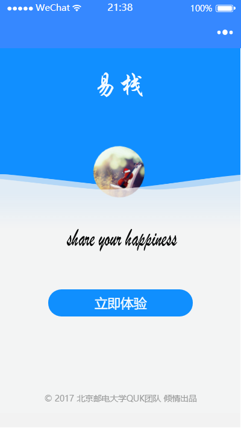
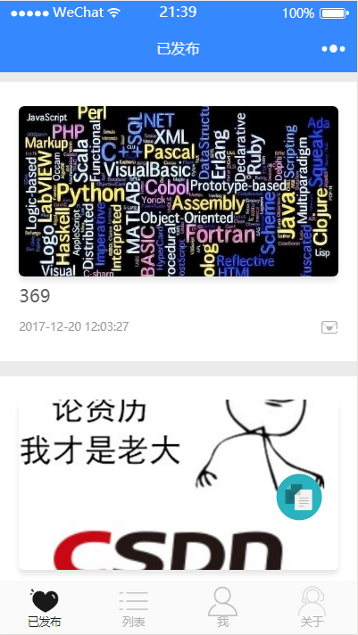
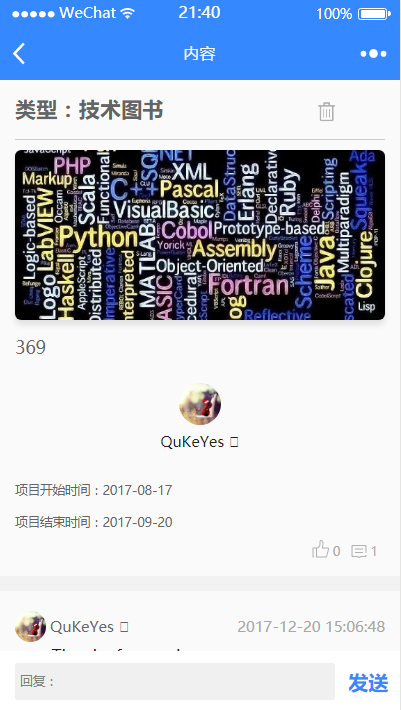
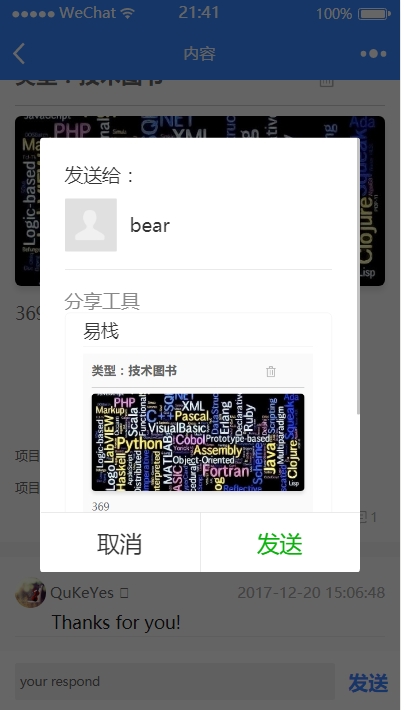

# Bmob-wechatApp-yizhan

## 线上演示

> 此代码与线上有细微区别，功能与线上基本一致，线上代码基于PHP+MYSQL开发。

#### 版本 v0.1.1

> **Note:**
> - 第一个版本，建设简单的博客类小程序

----------

使用步骤：

* 第一步：创建项目，记得填入你自己的AppId(必须填入AppId，不然无法调用wx.login())。

* 第二步：下载该demo。

* 第三步：在微信小程序管理后台中配置服务器域名为`https://api.bmob.cn`。

* 第四步：在Bmob后台创建应用，将你的AppID(小程序ID)和AppSecret(小程序密钥)填写到Bmob的微信小程序配置密钥中。

* 第五步：将你的Application ID和REST API Key替换app.js中的Bmob.initialize("e3cecf75da3d8316729ee905e81f5ac1", "adf78f7709798f97d6bb9aef6a7624ad")。

* 第六步：创建表和字段：
    * (1)在_User表中新建字段userPic(String),nickname(String)
    * (2)新建Diary表，新建字段title(String),publisher(Pointer)<关联_User表>,pic(File),likeNum(Number),is_hide(String),content(String),commentNum(Number),liker(Array)
    * (3)新建Comments表，新建字段publisher(Pointer)<关联_User表>,olderUserName(String),olderComment(Pointer)<关联Comments表>,mood(Pointer)<关联Diary表>,content(String)

> 目前系统支持自动创建库与表，可在项目交易找到易栈。

---

## 注意事项

> 1. 代码之前是用Bmob老版本SDK开发， 微信所有授权域名统一填写`api.bmob.cn`

## 项目截图

如有疑问或建议，请加QQ546227169进行咨询